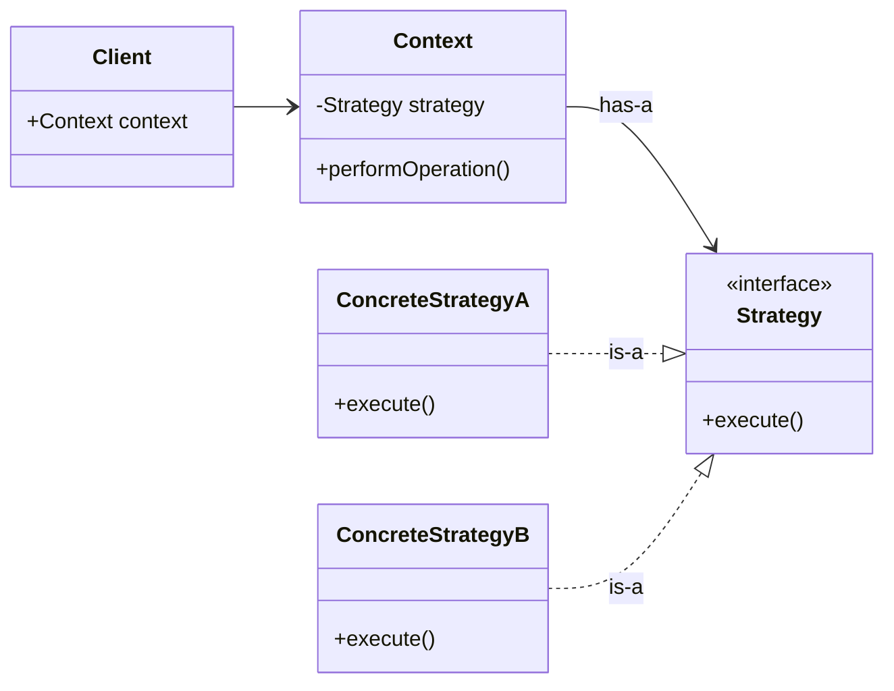
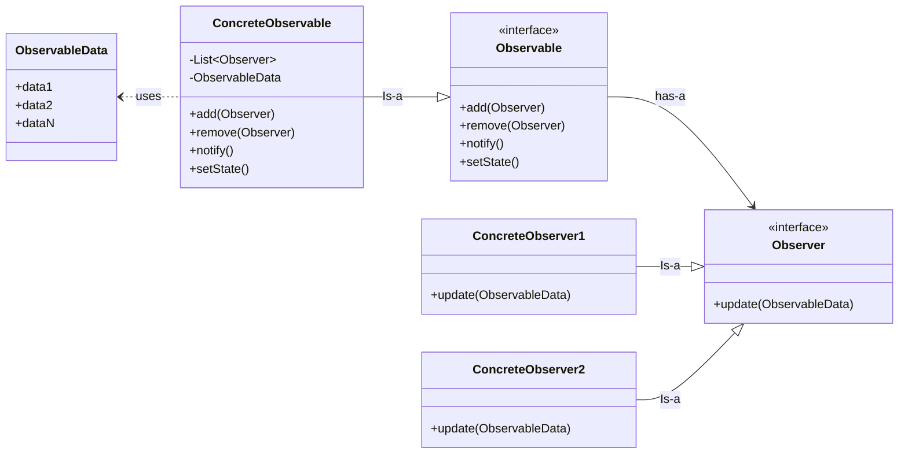
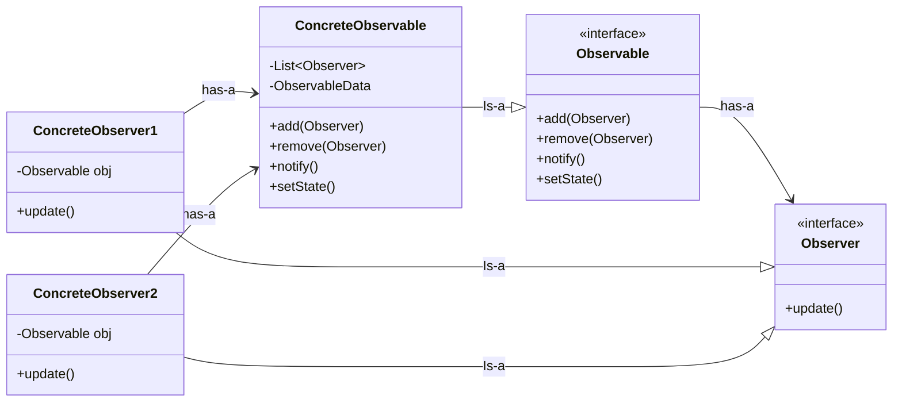

# Low-Level Design (LLD) Study Notes

This repository contains my personal notes and progress as I study **Design Principles and Patterns** in the context of Low-Level Design.

---

## 🏛️ SOLID Principles
The SOLID principles are a set of five design principles intended to make software designs more understandable, flexible, and maintainable.

| Principle | Name | Key Concept |
| :--- | :--- | :--- |
| **S** | **Single Responsibility** | One class, one reason to change. |
| **O** | **Open/Closed** | Open for extension, closed for modification. |
| **L** | **Liskov Substitution** | Subclasses must be substitutable for base classes. |
| **I** | **Interface Segregation** | Avoid forcing clients to implement unused methods. |
| **D** | **Dependency Inversion** | Depend on abstractions, not concretions. |

---

### 1. Single Responsibility Principle (SRP)
* A class should have **only one reason to change**.
* This means a class should have only one responsibility or one specific job within the system.

### 2. Open/Closed Principle (OCP)
* Software entities should be **open for extension but closed for modification**.
* New functionality should be added through inheritance or composition rather than by modifying existing, tested code.

### 3. Liskov Substitution Principle (LSP)
* Objects of a superclass should be **replaceable** with objects of its subclass without breaking the application.
* **Key takeaways:**
    * If class $B$ is a subtype of class $A$, then we should be able to replace $A$ with $B$ without breaking the behavior of the program.
    * Any implementation of an interface should be substitutable for another without breaking expected contracts.
    * A subclass should **extend** the capability of the parent class, not narrow it down.

### 4. Interface Segregation Principle (ISP)
* Interfaces should be designed such that the **client should not be forced to implement functions they do not need**.
* It is better to have multiple specific interfaces than one large, "fat" interface.

### 5. Dependency Inversion Principle (DIP)
* High-level components should not depend on low-level components directly.
* Instead, both should **depend on abstractions** (interfaces or abstract classes).

---

## 🎭 Behavioral Design Patterns
Behavioral patterns focus on how objects distribute work and how they communicate with one another. Instead of just focusing on how objects are structured, these patterns define the **flow of data and responsibility** between them.

---

### 🟢 Strategy Pattern
* Defines a family of algorithms, encapsulates each one, and makes them interchangeable.
* **Key takeaways:**
  * It allows the algorithm to vary independently from the clients that use it.
  * Helps in avoiding a massive amount of conditional logic (if-else or switch cases) by delegating the task to a specific strategy object.
  * Promotes the **Open/Closed Principle** as new strategies can be added without modifying the existing context code.
  * Uses **composition** instead of inheritance to switch behaviors at runtime.
  * Useful when we have multiple ways to perform a task and want to choose the approach dynamically.

---

### 🖼️ Strategy Pattern UML Structure

---

### 🔔 Observer Pattern
* Defines a one-to-many dependency between objects so that when one object changes state, all its dependents are notified and updated automatically.
* It is a design pattern where an object (observer / publisher) maintains a list of dependents (observer) and automatically notifies dependants whenever there is change in state.
* **Key takeaways:**
  * **Subject & Observer:** The "Subject" (Observable) maintains a list of "Observers" and notifies them of any state changes.
  * **Loose Coupling:** The Subject doesn't need to know the specific details of the Observer classes; it only knows they implement a specific interface.
  * **Push vs. Pull:** Information can be "pushed" by the Subject to observers, or observers can "pull" the specific data they need after notification.
  * **Real-world Example:** A YouTube channel (Subject) notifying its subscribers (Observers) when a new video is uploaded.

---

### 🖼️ Observer Pattern UML Structure (Push Model)

---
### 🖼️ Observer Pattern UML Structure (Pull Model)

---
*Last Updated: March 2026*
