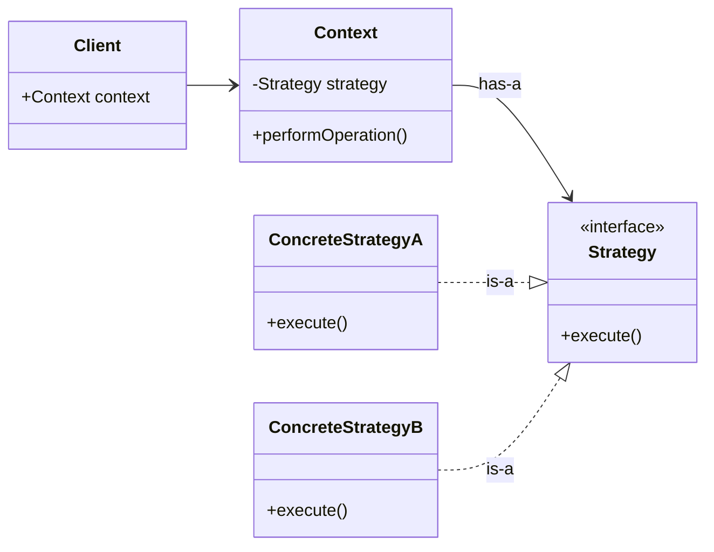
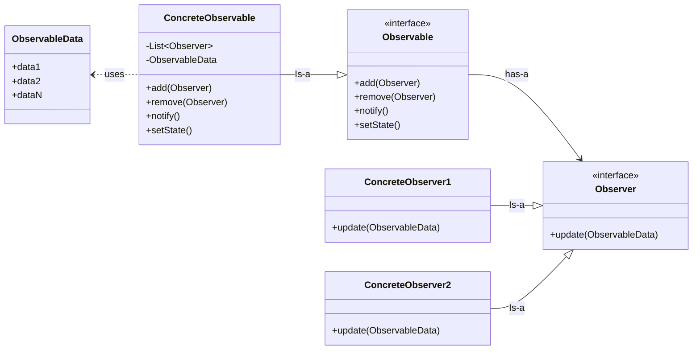
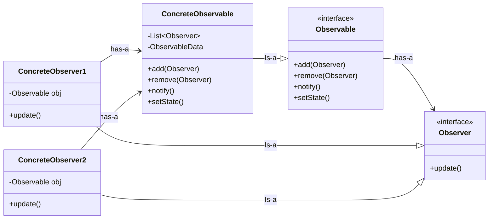
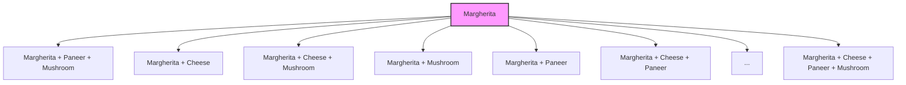
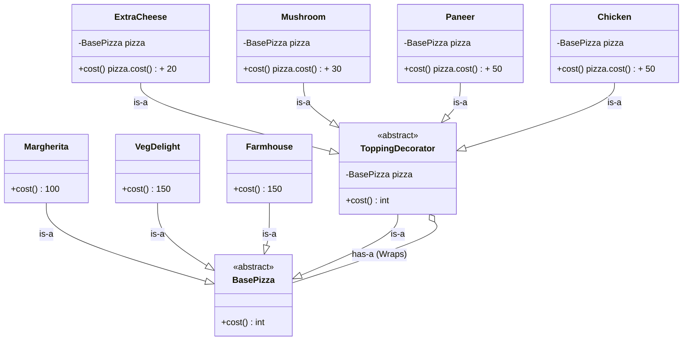
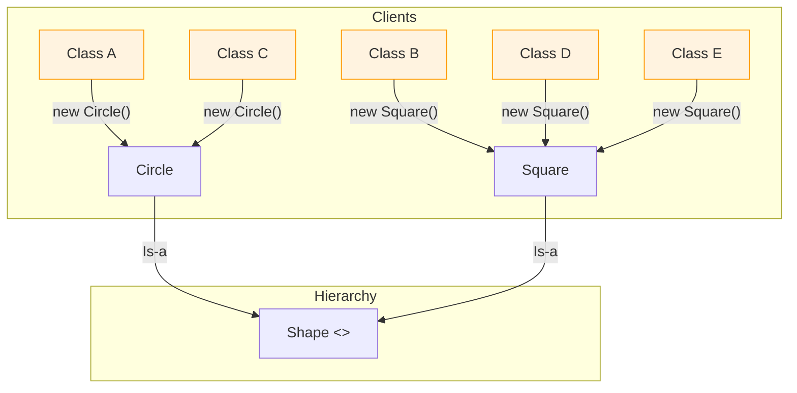

# Low-Level Design (LLD) Study Notes

This repository contains my personal notes and progress as I study **Design Principles and Patterns** in the context of Low-Level Design.

---

## 🏛️ SOLID Principles
The SOLID principles are a set of five design principles intended to make software designs more understandable, flexible, and maintainable.

| Principle | Name | Key Concept |
| :--- | :--- | :--- |
| **S** | **Single Responsibility** | One class, one reason to change. |
| **O** | **Open/Closed** | Open for extension, closed for modification. |
| **L** | **Liskov Substitution** | Subclasses must be substitutable for base classes. |
| **I** | **Interface Segregation** | Avoid forcing clients to implement unused methods. |
| **D** | **Dependency Inversion** | Depend on abstractions, not concretions. |

---

### 1. Single Responsibility Principle (SRP)
* A class should have **only one reason to change**.
* This means a class should have only one responsibility or one specific job within the system.

### 2. Open/Closed Principle (OCP)
* Software entities should be **open for extension but closed for modification**.
* New functionality should be added through inheritance or composition rather than by modifying existing, tested code.

### 3. Liskov Substitution Principle (LSP)
* Objects of a superclass should be **replaceable** with objects of its subclass without breaking the application.
* **Key takeaways:**
    * If class $B$ is a subtype of class $A$, then we should be able to replace $A$ with $B$ without breaking the behavior of the program.
    * Any implementation of an interface should be substitutable for another without breaking expected contracts.
    * A subclass should **extend** the capability of the parent class, not narrow it down.

### 4. Interface Segregation Principle (ISP)
* Interfaces should be designed such that the **client should not be forced to implement functions they do not need**.
* It is better to have multiple specific interfaces than one large, "fat" interface.

### 5. Dependency Inversion Principle (DIP)
* High-level components should not depend on low-level components directly.
* Instead, both should **depend on abstractions** (interfaces or abstract classes).

---

## 🎭 Behavioral Design Patterns
Behavioral patterns focus on how objects distribute work and how they communicate with one another. Instead of just focusing on how objects are structured, these patterns define the **flow of data and responsibility** between them.

---

### 🟢 Strategy Pattern
* Defines a family of algorithms, encapsulates each one, and makes them interchangeable.
* **Key takeaways:**
  * It allows the algorithm to vary independently from the clients that use it.
  * Helps in avoiding a massive amount of conditional logic (if-else or switch cases) by delegating the task to a specific strategy object.
  * Promotes the **Open/Closed Principle** as new strategies can be added without modifying the existing context code.
  * Uses **composition** instead of inheritance to switch behaviors at runtime.
  * Useful when we have multiple ways to perform a task and want to choose the approach dynamically.

---

### 🖼️ Strategy Pattern UML Structure

---

### 🔔 Observer Pattern
* Defines a one-to-many dependency between objects so that when one object changes state, all its dependents are notified and updated automatically.
* It is a design pattern where an object (observer / publisher) maintains a list of dependents (observer) and automatically notifies dependants whenever there is change in state.
* **Key takeaways:**
  * **Subject & Observer:** The "Subject" (Observable) maintains a list of "Observers" and notifies them of any state changes.
  * **Loose Coupling:** The Subject doesn't need to know the specific details of the Observer classes; it only knows they implement a specific interface.
  * **Push vs. Pull:** Information can be "pushed" by the Subject to observers, or observers can "pull" the specific data they need after notification.
  * **Real-world Example:** A YouTube channel (Subject) notifying its subscribers (Observers) when a new video is uploaded.

---

### 🖼️ Observer Pattern UML Structure (Push Model)

---
### 🖼️ Observer Pattern UML Structure (Pull Model)

---

## 🏗️ Structural Design Patterns
Structural patterns explain how to assemble objects and classes into larger structures while keeping these structures flexible and efficient. They focus on how classes and objects are composed to form larger structures.

---

### 🟢 Decorator Pattern
* A structural pattern that allows behavior to be added to an individual object, dynamically, without affecting the behavior of other objects from the same class.
* Decorator pattern allows you to add new functionality to objects dynamically without altering the original structure.
* **Key takeaways:**
  * **Wrappers:** Often referred to as a "Wrapper" because it wraps the original object in a new object that adds functionality.
  * **Dynamic Extension:** Provides a flexible alternative to subclassing for extending functionality.
  * **Composition Over Inheritance:** Instead of creating a complex hierarchy of subclasses to cover every combination of features, you compose objects together.
  * **Interface Consistency:** The decorator implements the same interface as the object it decorates, so the client doesn't know the difference between the "plain" object and the "decorated" one.
  * **Example:** Adding toppings to a Pizza or adding features (GPS, Sunroof) to a Basic Car object.

---

### 🍕 The Problem: Without Decorator Pattern (Class Explosion)

When we try to handle multiple combinations using only inheritance, we run into a "Class Explosion." For every new feature or topping, we are forced to create a new class for every possible combination.

**Key Takeaways:**
* **Class Explosion:** We are creating classes for all possible combinations.
* **Maintenance Nightmare:** If 1 new topping is introduced, we have to create a massive amount of new combination classes.
* **Violation of OCP:** Every time a new topping is added, we are essentially "modifying" our system's complexity rather than extending it cleanly.

### 🟢 Structural Pattern: Decorator Pattern
The **Decorator Pattern** allows you to attach new behaviors to objects dynamically by placing these objects inside special wrapper classes that contain the behaviors.

---

### 🍕 The Solution: With Decorator Pattern
Instead of "Class Explosion," we use **Composition** and **Inheritance** together to wrap a base object with any number of toppings.

---

## 🏗️ Creational Design Patterns
Creational patterns deal with **object creation mechanisms**, trying to create objects in a manner suitable to the situation. They reduce complexity by controlling how objects are instantiated, ensuring that the system is independent of how its objects are created, composed, and represented.

---

### 🏭 Factory Pattern
The **Factory Pattern** (specifically Factory Method) provides an interface for creating objects in a superclass but allows subclasses to alter the type of objects that will be created.

* **Key takeaways:**
  * **Abstraction of Creation:** It hides the instantiation logic from the client.
  * **Loose Coupling:** The client interacts with an interface or abstract class rather than a specific concrete implementation.
  * **Follows OCP:** You can introduce new types of objects (subclasses) without breaking existing client code.
  * **Example:** A `ShapeFactory` that returns either a `Circle` or a `Square` based on an input string.

---

### 🏰 Abstract Factory Pattern
The **Abstract Factory Pattern** is a "factory of factories." It provides an interface for creating **families of related or dependent objects** without specifying their concrete classes.

* **Key takeaways:**
  * **Family Consistency:** It ensures that the objects created from one factory are compatible with each other (e.g., a "Dark Mode" factory creates only dark buttons and dark checkboxes).
  * **Constraint:** Useful when a system should be independent of how its products are created, but those products must work together.
  * **Higher Abstraction:** While Factory handles one product, Abstract Factory handles a set of related products.

---

### ⚠️ The Problem: Direct Instantiation (Tightly Coupled)

When classes directly instantiate objects using the `new` keyword, it leads to several maintenance and architectural issues.

**Key Issues Identified:**
* **Tight Coupling:** The client classes (A, B, C, etc.) are tightly coupled to concrete implementations (Circle, Square).
* **Maintenance Overhead:** If the constructor of Square changes (e.g., adding a parameter), you must manually update every single class that calls new Square().
* **Violation of DIP:** High-level modules are depending on low-level concrete classes rather than the Shape abstraction.
* **Lack of Flexibility:** It is difficult to swap implementations (e.g., replacing Square with Rectangle) without modifying all client code.

---

### 🏭 Simple / Practical Factory Pattern
The **Simple Factory Pattern** is not officially a GoF design pattern, but it is a widely used programming idiom to encapsulate the creation of objects. It uses a static method in a dedicated class to create objects of various types based on given information.

* **Key takeaways:**
  * **Centralized Creation:** Instead of clients calling `new` multiple times across the codebase, all instantiation logic is moved to a single `Factory` class.
  * **Decoupling:** Client classes (Class A, B, C, etc.) only depend on the `Shape` interface and the `Factory`, not the concrete classes (`Circle`, `Square`).
  * **Ease of Change:** If the constructor or creation logic of a product changes, you only need to update it in one place (the Factory).
  * **Conditional Logic:** The Factory typically uses an `if-else` or `switch` block to decide which concrete class to instantiate at runtime.
  * If there is any change in creation logic, it will be changed only at Factory class. Instead of multiple classes across the project.
  * **Violation of OCP:** If any new Shape is introduced then we have to touch this Factory class.
  * Factory class can become bloated: If object creation is complex then this class becomes difficult to manage.
  * **Leads to Violation of SRP:** Factory does 2 things, selection & construction logic.
---

### 🏭 Factory Method Pattern
The **Factory Method Pattern** is a creational design pattern that provides an interface for creating objects in a superclass, but allows subclasses to alter the type of objects that will be created.

* **Key takeaways:**
  * **Deals with the Problem of Creation:** Instead of a single "Simple Factory" class handling all logic, the responsibility is moved to a factory method in the subclasses.
  * **Dependency Inversion:** High-level code (the Client) depends on the **Creator abstraction** and the **Product interface**, rather than concrete implementations.
  * **Extensibility:** You can introduce new types of products by creating a new Creator subclass without modifying existing code (adhering to the **Open/Closed Principle**).
  * **Runtime Flexibility:** The specific subclass of the Creator determines which concrete product is instantiated at runtime.
  * **Violation of OCP:** If any new shape is introduced then we now have flexibility to create a new Shape Factory class which supports OCP, but the place where we select this factory class still breaks the principle.
  
---

### 🏰 Abstract Factory Pattern
The **Abstract Factory Pattern** is a creational design pattern that lets you produce **families of related or dependent objects** without specifying their concrete classes. It is often referred to as a "Factory of Factories."

* **Key takeaways:**
  * **Family Consistency:** It ensures that objects created from the same factory are compatible with each other (e.g., a `MacFactory` produces a `MacButton` and a `MacCheckbox`, ensuring they match the OS theme).
  * **Higher Abstraction:** While the Factory Method handles the creation of a single product, the Abstract Factory handles a suite of related products.
  * **Constraint-Based Creation:** Useful when a system should be independent of how its products are created, but those products must be used together as a set.
  * **Avoids Tight Coupling:** The client code interacts only with the abstract interfaces of the factory and the products, keeping the system highly decoupled and easy to maintain.
  
---

*Last Updated: March 2026*
