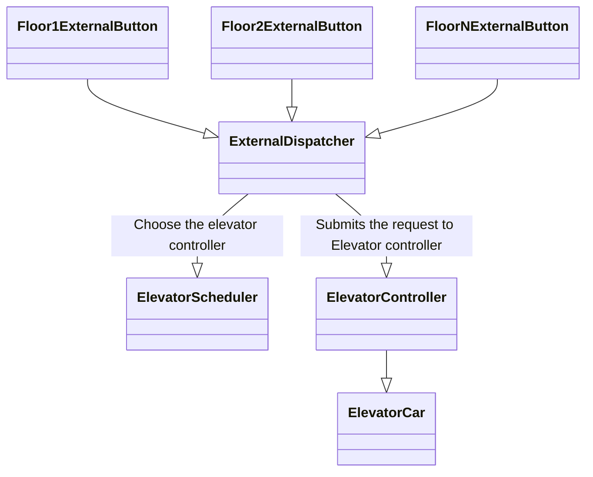
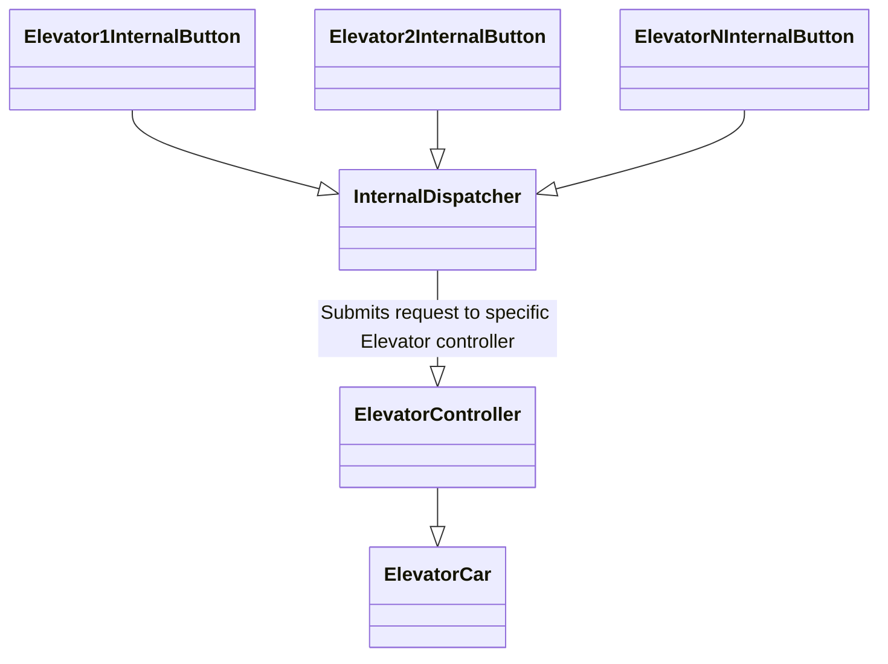
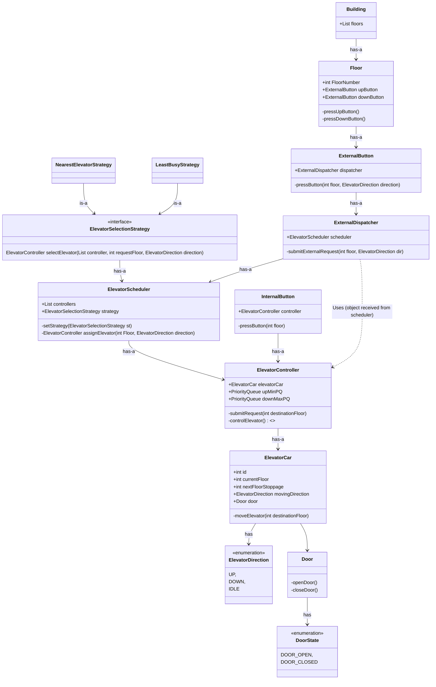

# 🛗 System Design: Elevator (LLD)

## 1. Functionality Requirements

* **Multi-Elevator System:** A building has multiple elevators and multiple floors.
* **External Requests:** A user can request an elevator externally using **Up / Down** buttons at each floor.
* **Smart Dispatching:** These direction buttons are used to choose the best elevator to serve the request.
* **Request Assignment:** Once an elevator is chosen, the floor is added to that particular elevator's "bucket list."
* **Internal Requests:** A user inside the elevator can press an internal button to select a destination floor.
* **Idle State:** Elevators remain idle (sleep) when no requests exist and activate immediately when a new request arrives.
* **Directional Ordering:** Requests are processed and ordered by direction to optimize movement:
    * **Going Up:** Visit floors in **ascending** order.
    * **Going Down:** Visit floors in **descending** order.

## 2. Technical Considerations

### Dispatching Logic
The system evaluates the state of all elevators (Current Floor, Direction, and Current Load) to assign the most efficient car to an external floor request.

### Request Management
Each elevator maintains two sets of requests:
1. **Upward Buffer:** A collection of destination floors above the current floor, sorted in ascending order.
2. **Downward Buffer:** A collection of destination floors below the current floor, sorted in descending order.

### State Transitions
* **IDLE:** No pending requests in either buffer.
* **MOVING_UP:** Processing the Upward Buffer until empty.
* **MOVING_DOWN:** Processing the Downward Buffer until empty.

---

## 🏗️ Object Identification

### 1. Building
The top-level container that manages the collection of **Floors** and the **Elevator Scheduler**.

### 2. Floor
Represents an individual level in the building. Each floor is equipped with **External Buttons**.

### 3. Elevator (POJO)
A Plain Old Java Object representing the physical car. It maintains state data:
* `currentFloor`
* `direction` (UP, DOWN, IDLE)
* `status` (MOVING, STOPPED)

### 4. ElevatorController
Each elevator is mapped to its own controller. It is responsible for:
* Managing the "bucket list" of requests for its specific elevator.
* Controlling the elevator's movement and door logic.

### 5. External Button
Located at each floor. It allows users to signal their desired direction (UP/DOWN) to the system.

### 6. Internal Button
Located inside each elevator car. It allows users to input their specific destination floor.

### 7. Elevator Scheduler
The central orchestrator of the system.
* Maintains a list of all **ElevatorControllers**.
* Implements the **Elevator Selection Strategy** to choose the most efficient elevator to serve an external request.

### 8. External Dispatcher
Acts as the bridge between the **External Buttons** and the **Elevator Controllers**, routing the floor signals to the Scheduler for processing.

### 9. Internal Dispatcher
Acts as a proxy between the **Internal Buttons** and the **Elevator Controller**.
* **Validation & Logging:** Ensures requests are valid and provides a centralized hook for monitoring.
* **Consistency:** Mirrors the architecture of the External Dispatcher for a cleaner, unified communication flow.

---

### External Dispatcher

---

### Internal Dispatcher

---

## 🧠 Elevator Selection Strategy

When an external button is pressed, the system must decide which elevator is best suited to handle the request. This decision is made by the **Elevator Scheduler** using a specific algorithm.

### Input Data for Selection:
1. **User Request Info:**
  * **Floor:** The floor where the user is currently waiting.
  * **Direction:** Whether the user wants to go **UP** or **DOWN**.
2. **Elevator State Info (from all available cars):**
  * **Request Bucket:** The current list of floors the elevator is already committed to visiting.
  * **Elevator Direction:** Its current movement state (UP, DOWN, or IDLE).
  * **Current Floor:** Its real-time position in the building.

### Strategy Types:
* **Nearest Elevator:** Calculates the absolute distance ($|Current Floor - Request Floor|$) and selects the closest car.
* **Least Busy Elevator:** Selects the car with the fewest number of pending requests in its bucket list to ensure load balancing.
* **Directional Affinity:** Prioritizes elevators already moving in the requested direction and haven't passed the request floor yet.

---

## ↕️ Elevator Car Moving Behavior

To ensure efficiency, requests are ordered by direction. The system can implement one of the following movement algorithms:

### 1. SCAN Algorithm (Elevator Algorithm)
* The elevator moves in one direction (e.g., Up) serving all requests along the way.
* **End-to-End:** It continues until it reaches the very last floor (top or bottom) of the building before reversing direction.
* *Example:* An elevator will travel to the top floor even if the highest pending request was several floors below.

### 2. LOOK Algorithm
* This is an optimized version of the SCAN algorithm.
* **Request-Based reversal:** The elevator moves in one direction serving requests, but it **does not** go to the very end of the building.
* It reverses direction as soon as there are no more requests pending in its current direction of travel.
* *Example:* If the highest request is on Floor 8 of a 10-floor building, the elevator will stop and reverse at Floor 8.

1.  **Min-Priority Queue:** Used when the elevator is going **UP**. It serves requests in **ascending** order so the nearest floor above the current position is always at the head.
2.  **Max-Priority Queue:** Used when the elevator is going **DOWN**. It serves requests in **descending** order so the nearest floor below the current position is always at the head.

**Workflow:**
* As the elevator moves, it polls the active queue.
* Once the active queue is empty, it switches to the other queue and reverses its direction.

---

## 🚠 Elevator UML 
* **ElevatorCar:** An object which moves to particular destination when asked to 
* **ElevatorController:** An object which controls a particular elevator
* **ElevatorScheduler:** Maintains the list of ElevatorControllers + also has ElevatorSelectionStrategy to choose the best Elevator to serve the request

---

