# System Design: Parking Lot (LLD)

A scalable and maintainable Low-Level Design for a Parking Lot system, focusing on SOLID principles and Design Patterns.

---

## 📋 1. Requirements & Constraints
### Functional Requirements:
- [ ] Multiple entry and exit points.
- [ ] Support for different vehicle types (e.g., Bike, Car, Truck).
- [ ] Different parking spot types (e.g., Mini, Compact, Large, EV).
- [ ] Real-time availability tracking.
- [ ] Ticket generation and payment processing based on duration.

### Non-Functional Requirements:
- **Maintainability:** Easy to add new vehicle or spot types (OCP).
- **Scalability:** Should handle multiple floors and thousands of spots.

---

## 🏗️ 2. Key Entities & Class Diagram
*(We will build this out as you study)*

- **EntryGate:** 
- **ParkingLevel:** 
- **ParkingSpot:** 
- **Vehicle:** 
- **Ticket:**
- **Payment**
- **ExitGate** 

---

### 🚘 ParkingLot UML
To handle different vehicle types and parking logic efficiently, we use a **Manager** hierarchy combined with the **Strategy Pattern**. This ensures the system can find and assign spots based on different rules (like nearest to entry or random) without changing the core management logic.

```mermaid
classDiagram
    class Vehicle {
        -String vehicleNumber
        -VehicleType vehicleType
        +getVehicleNumber() String
        +getVehicleType() VehicleType
    }
    class VehicleType {
        <<enumeration>>
        FOUR_WHEELER
        TWO_WHEELER
    }
    class ParkingSpotManager {
        <<abstract>>
        +park() ParkingSpot
        +unPark(ParkingSpot spot) void
        +hasFreeSpot() boolean
    }
    class TwoWheelerSpotManager {
        -List~ParkingSpot~ spots
        -ParkingSpotLookupStrategy strategy
        -ReentrantLock lock
        +park() ParkingSpot
        +unPark(ParkingSpot spot) void
        +hasFreeSpot() boolean
    }
    class FourWheelerSpotManager {
        -List~ParkingSpot~ spots
        -ParkingSpotLookupStrategy strategy
        -ReentrantLock lock
        +park() ParkingSpot
        +unPark(ParkingSpot spot) void
        +hasFreeSpot() boolean
    }
    class ParkingLevel {
        -int levelNumber
        -Map~VehicleType, ParkingSpotManager~ managers
        +hasAvailability() boolean
        +park(VehicleType type) ParkingSpot
        +unPark(VehicleType type, ParkingSpot spot) void
    }
    class ParkingBuilding {
        -List~ParkingLevel~ levels
        +TicketAllocate(Vehicle vehicle)
        +release(Ticket ticket) void
    }
    class ParkingSpotLookupStrategy {
        <<interface>>
        +selectSpot(List~ParkingSpot~ spots) ParkingSpot
    }
    class RandomSpotLookupStrategy {
        +selectSpot(List~ParkingSpot~ spots) ParkingSpot
    }
    class NearestToEntryGate {
        +selectSpot(List~ParkingSpot~ spots) ParkingSpot
    }
    class ParkingSpot {
        -String spotId
        -boolean free
        +isSpotFree() boolean
        +occupySpot() void
        +releaseSpot() void
    }
    class ParkingLot {
        -ParkingBuilding building
        -EntranceGate entranceGate
        +Ticket vehicleArrives(Vehicle vehicle)
    }
    class EntranceGate {
        +Ticket enter(ParkingBuilding building, Vehicle vehicle)
    }
    class Ticket {
        -Vehicle vehicle
        -ParkingLevel level
        -ParkingSpot spot
        -LocalDateTime entryTime
    }
    class CostComputation {
        -PricingStrategy pricingStrategy
        +compute(Ticket ticket) double
    }
    class PricingStrategy {
        <<interface>>
        +calculate(Ticket ticket) double
    }
    class FixedPricingStrategy {
        
    }
    class HourlyPricingStrategy {

    }
    class Payment {
        <<interface>>
        pay(double amount) boolean
    }
    class CashPayment {
        
    }
    class UPIPayment {
        
    }

    Vehicle --> VehicleType : has-a
    TwoWheelerSpotManager --|> ParkingSpotManager : Is-a
    FourWheelerSpotManager --|> ParkingSpotManager : Is-a
    ParkingSpotManager --> ParkingSpot : Has-a
    ParkingSpotManager --> ParkingSpotLookupStrategy : Has-a
    RandomSpotLookupStrategy ..|> ParkingSpotLookupStrategy : Is-a
    NearestToEntryGate ..|> ParkingSpotLookupStrategy : Is-a
    ParkingLevel "1" --> "many" ParkingSpotManager : Has-a
    ParkingLevel "many" *-- "1" ParkingBuilding : Has-a
    ParkingLot --> ParkingBuilding : has-a
    ParkingLot --> EntranceGate : has-a
    EntranceGate ..> ParkingBuilding : invokes
    EntranceGate ..> Ticket : creates
    CostComputation "1" --> "1" PricingStrategy : has-a
    ExitGate "1" --> "1" CostComputation : has-a
    ExitGate ..> ParkingBuilding : invokes
    FixedPricingStrategy --> PricingStrategy
    HourlyPricingStrategy --> PricingStrategy
    ExitGate ..> Payment : invokes
    CashPayment --> Payment
    UPIPayment --> Payment
```

