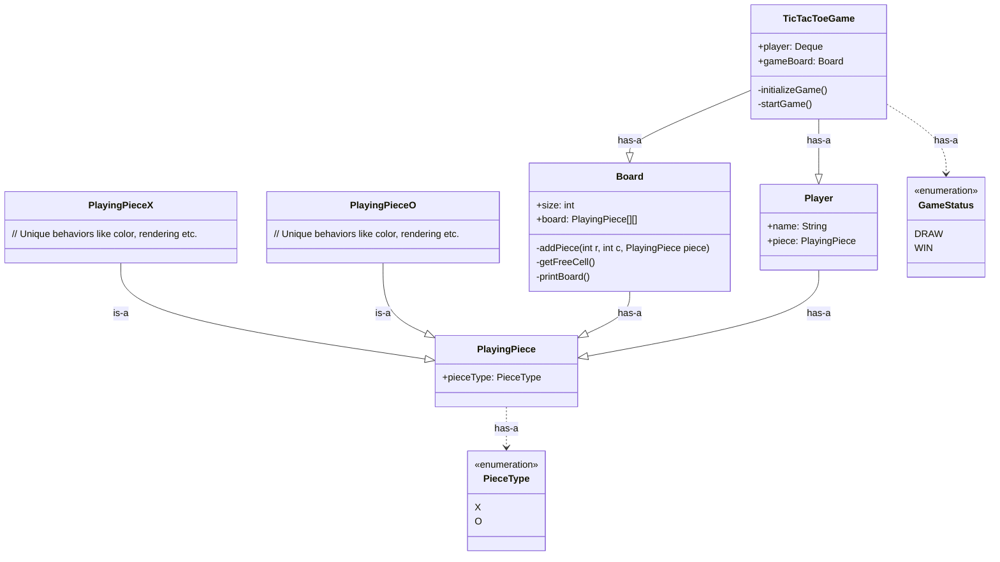

# 🎮 System Design: Tic-Tac-Toe (LLD)

This project focuses on the Low-Level Design of a classic Tic-Tac-Toe game, emphasizing clean object-oriented principles, state management, and scalability for $N \times N$ boards.

---

## 📜 Game & Rules

* It is a simple two player paper and pencil game.
* Each player selects a piece before the game i.e 'X' or 'O'.
* Players take turn placing it on the 3 x 3 grid.
* A players wins by placing three of its pieces in a row, column or diagonal.
* The game ends when a player wins or when all grid cells are filled, resulting in a draw.

---

## 📋 1. Requirements & Constraints

* **Board:** A 3x3 grid by default, but the design should be scalable to any $N \times N$ size.
* **Players:** Support for 2 players (Human vs. Human or Human vs. Bot).
* **Symbols:** Each player is assigned a unique piece (e.g., **X** or **O**).
* **Winning Condition:** A player wins if they occupy a full row, full column, or either of the two main diagonals with their symbol.
* **Draw:** The game results in a draw if the board is completely filled and no winning condition is met.

---

### 🕹️ Tic-Tac-Toe UML

